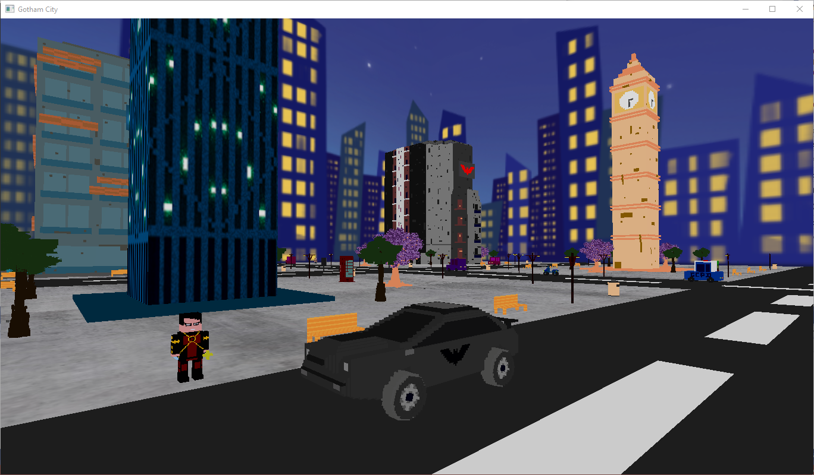

# Gotham City :sparkles:
Proyecto de computación gráfica semestre 2022-2: Gotham City estilo Voxel Art

## Autora 🙋
Lázaro Martínez A. Ariadna.
Estudiante Mexicana. Actualmente curso el 8vo Semestre de Ingeniería en computación de la Facultad de Ingeniería de la UNAM.

## Documentación :page_with_curl:

### Planeación :calendar:

- [Evidencia del sistema de Almacenamiento-Español](Docs/Herramienta_Desarrollo_GitHub.pdf)
- [Evidencia del sistema de Almacenamiento-Inglés](Docs/Development_Tool_GitHub_Translate.pdf)
- [Documento de Propuesta](Docs/Propuesta.pdf)
- [Croquis/Boceto](Docs/Boceto.pdf)
- [Diagrama de Gantt](Docs/DiagramaGantt.xlsx)

### Desarrollo :computer:

- [Bitácora-Español](Docs/Bitcora_de_Proyecto.pdf)
- [Bitácora-Inglés](Docs/Project_Log.pdf)
- [Bitacora (Web)-Español](https://saber-eyebrow-039.notion.site/Bit-cora-de-Proyecto-b106fc2e473b4a699981fdb58a79be85)
- [Bitacora (Web)-Inglés](https://saber-eyebrow-039.notion.site/Project-Log-a73b7b203b274a1d8833cf218c3e2f1b)
- [Ejecutable](https://github.com/Ari3839/Gotham/tree/main/Ejecutables)
- [Manual de usuario-Español](Docs/Manual_Usuario_GothamCity.pdf)
- [Manual de usuario-Inglés](Docs/User_Manual_GothamCity.pdf)
- [Manual técnico-Español](Docs/Manual_Tecnico_GothamCity.pdf)
- [Manual técnico-Inglés](Docs/Technical_Manual_GothamCity.pdf)
- [Video]()

# Gotham City :sparkles:
Graphic Computing Project semester 2022-2: Gotham City in Voxel Art style. 

## Author 🙋
Lázaro Martínez A. Ariadna.
Mexican student. Currently taking the 8th semester of my Computer engineering major in the Engineering Faculty of the UNAM.

## Documentation :page_with_curl:

### Planning :calendar:

- [Development Tool Evidence-Spanish](Docs/Herramienta_Desarrollo_GitHub.pdf)
- [Development Tool Evidence-English](Docs/Development_Tool_GitHub_Translate.pdf)
- [Proposal Document](Docs/Propuesta.pdf)
- [Draft](Docs/Boceto.pdf)
- [Gantt Diagram](Docs/DiagramaGantt.xlsx)

### Desarrollo :computer:

- [Log-Spanish](Docs/Bitcora_de_Proyecto.pdf)
- [Log-English](Docs/Project_Log.pdf)
- [Log (Web)-Spanish](https://saber-eyebrow-039.notion.site/Bit-cora-de-Proyecto-b106fc2e473b4a699981fdb58a79be85)
- [Log (Web)-English](https://saber-eyebrow-039.notion.site/Project-Log-a73b7b203b274a1d8833cf218c3e2f1b)
- [Executable](https://github.com/Ari3839/Gotham/tree/main/Ejecutables)
- [User Manual-Spanish](Docs/Manual_Usuario_GothamCity.pdf)
- [User Manual-English](Docs/User_Manual_GothamCity.pdf)
- [Technical Manual-Spanish](Docs/Manual_Tecnico_GothamCity.pdf)
- [Technical Manual-English](Docs/Technical_Manual_GothamCity.pdf)
- [Video]()  